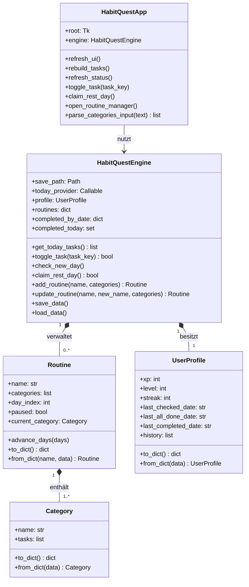

# HabitQuest

Software-Entwurf, Coding-Guidelines und GitHub-Workflow

## Inhaltsverzeichnis

- [Setup](#setup)
1. [Konzeptionelle Beschreibung des Use-Cases](#1-konzeptionelle-beschreibung-des-use-cases)
  1. [Architektur und Klassen (Ist-Stand)](#11-architektur-und-klassen-ist-stand)
   2. [Interaktion der Objekte](#12-interaktion-der-objekte)
  3. [Wichtige Attribute und Methoden](#13-wichtige-attribute-und-methoden)
2. [Coding-Guidelines](#2-coding-guidelines)
3. [Aufwandsschätzung](#3-aufwandsschätzung)
4. [Geplante Implementierung und Versionsverwaltung](#4-geplante-implementierung-und-versionsverwaltung)
   1. [Git-Workflow: dev / main](#41-git-workflow-dev--main)
   2. [Continuous Integration (CI)](#42-continuous-integration-ci)
5. [Fazit & Ausblick (Limitationen)](#5-fazit--ausblick-limitationen)

## Setup

Bevor der Code ausgeführt werden kann, wähle einen der beiden Wege:

### Linux: Option A – venv + pip

1. Virtuelle Umgebung erstellen und aktivieren:

  ```bash
  python3 -m venv .venv
  source .venv/bin/activate
  ```

2. Setup-Skript ausführen (installiert `requirements.txt` und prüft Tkinter):

  ```bash
  bash scripts/setup.sh
  ```

3. Falls Tkinter auf deinem System nicht automatisch installiert werden konnte,
  installiere es manuell. Es ist ein Systempaket und kein Python-Paket:

  ```bash
  sudo apt-get install -y python3-tk
  ```

### Linux: Option B – Conda (inklusive Tkinter)

1. Conda-Umgebung aus `environment.yaml` erstellen/aktualisieren:

  ```bash
  bash scripts/setup_conda.sh
  ```

2. Falls du die Umgebung manuell aktivieren willst:

  ```bash
  conda activate habitquest
  ```

### Windows: Option A – PowerShell, venv + pip

1. Installiere Python 3.12 oder neuer über [python.org](https://www.python.org/downloads/windows/).
   Aktiviere im Installer **Add Python to PATH** und lasse **tcl/tk and IDLE** ausgewählt,
   damit Tkinter verfügbar ist.

2. Öffne PowerShell im Projektordner und erstelle sowie aktiviere die virtuelle Umgebung:

  ```powershell
  py -m venv .venv
  .\.venv\Scripts\Activate.ps1
  ```

   Falls PowerShell die Aktivierung blockiert, erlaube Skripte nur für die aktuelle Sitzung und
   führe anschließend den Aktivierungsbefehl erneut aus:

  ```powershell
  Set-ExecutionPolicy -Scope Process -ExecutionPolicy Bypass
  ```

3. Installiere die Python-Abhängigkeiten und prüfe Tkinter:

  ```powershell
  py -m pip install -r requirements.txt
  py -m tkinter
  ```

   Der zweite Befehl öffnet ein kleines Tkinter-Testfenster. Schließe es, nachdem die Prüfung
   erfolgreich war.

4. Starte die App oder die Tests:

  ```powershell
  py ui.py
  py -m unittest test_habit_quest.py
  ```

### Windows: Option B – Conda

Mit installierter Miniconda oder Anaconda kann die Umgebung in der **Anaconda Prompt** oder in
PowerShell erstellt werden:

```powershell
conda env create -f environment.yaml
conda activate habitquest
python ui.py
python -m unittest test_habit_quest.py
```

Wenn die Umgebung bereits existiert, ersetze den ersten Befehl durch
`conda env update -n habitquest -f environment.yaml --prune`.

### Start und Tests

Nach dem Linux-Setup über Option A oder B kann die Anwendung gestartet werden:

```bash
python3 ui.py
```

Die vollständige Testsuite wird mit folgendem Befehl ausgeführt:

```bash
python3 -m unittest test_habit_quest.py
```

Ohne grafische Display-Umgebung werden die Tkinter-Smoke-Tests automatisch übersprungen. Unter
Linux können mit `xvfb` auch diese UI-Tests headless ausgeführt werden:

```bash
sudo apt-get install -y xvfb
xvfb-run python3 -m unittest test_habit_quest.py
```

## 1 Konzeptionelle Beschreibung des Use-Cases

Das Ziel von HabitQuest ist es, sich täglich wiederholende Abläufe (Routinen) zu gamifizieren.
Dadurch soll ein Weg geschaffen werden, sich selbst durch spielerische Elemente wie Level und
Erfahrungspunkte (XP) langfristig zu motivieren.

In der Praxis sieht das so aus: Zunächst erstellt man als Nutzer mehrere Routinen (z. B. für
einen Trainingsplan wie Push, Pull und Legs). Öffnet man die Anwendung täglich, werden automatisch
die Aufgaben angezeigt, die am heutigen Zyklustag anstehen. Hakt man eine Aufgabe ab, gibt es
Erfahrungspunkte. Schafft man es, alle Aufgaben an einem Tag zu erledigen, steigt die „Streak"
(die Serie) an. Im Laufe der Zeit rotiert der Plan automatisch weiter, sodass man sich nicht jeden
Tag manuell überlegen muss, was eigentlich ansteht.

### 1.1 Architektur und Klassen (Ist-Stand)

Die Umsetzung trennt die grafische Benutzeroberfläche weiterhin strikt von Datenmodell und
Geschäftslogik. Das Diagramm zeigt den aktuellen Stand des MVPs. Kleinere Rendering- und
Fenster-Helper der UI sind bewusst nicht enthalten, damit die fachlichen Beziehungen lesbar
bleiben.

- **Datenmodelle (`models.py`)**: `Category`, `Routine` und `UserProfile` sind Python-
  `dataclasses`. Sie validieren ihre Eingaben und wandeln sich über `to_dict()` bzw.
  `from_dict()` in JSON-kompatible Daten um.
- **Geschäftslogik (`engine.py`)**: `HabitQuestEngine` verwaltet die Routinen, den aktuellen
  Nutzerfortschritt sowie Aufgabenabschlüsse pro Datum. Die Engine berechnet XP und Streaks,
  verarbeitet Tageswechsel und speichert atomar in einer JSON-Datei.
- **Benutzeroberfläche (`ui.py`)**: `HabitQuestApp` erstellt die Tkinter-Oberfläche, zeigt den
  Zustand der Engine an und delegiert Aktionen wie das Abhaken von Aufgaben oder die
  Routineverwaltung an die Engine. Die UI hält keine fachlichen Spieldaten selbst.

**Warum Tkinter?** Als UI-Framework wird Tkinter genutzt. Das passt gut, da es direkt in der
Python-Standardbibliothek enthalten ist, keine externen Installationen erfordert und völlig
ausreicht, um saubere Architektur-Konzepte wie MVC zu demonstrieren.

#### UML-Klassendiagramm der aktuellen OOP-Architektur



`HabitQuestEngine` verwendet zusätzlich eine lokale JSON-Datei als Persistenzschicht.
`completed_by_date` speichert Aufgabenabschlüsse je ISO-Datum; `completed_today` ist die
in-memory-Ansicht für den aktuellen Tag. Die Factory-Methoden `from_dict()` sind Klassenmethoden.

### 1.2 Interaktion der Objekte

Die Architektur orientiert sich an einer strikten Trennung von Präsentation, Geschäftslogik und
Datenmodell. Das Zusammenspiel funktioniert aktuell wie folgt:

1. **Initialisierung**: `ui.py` erstellt ein `tk.Tk`-Fenster und übergibt es an
  `HabitQuestApp`. Wenn keine Engine injiziert wurde, erzeugt die App selbst eine
  `HabitQuestEngine`.
2. **Laden und Tageswechsel**: Die Engine lädt Daten über `load_data()`, prüft mit
  `check_new_day()` verstrichene Tage und lädt anschließend die heutigen Abschlüsse. Nicht
  pausierte Routinen werden dabei um die verstrichenen Tage weitergeschaltet.
3. **Darstellung**: `HabitQuestApp.refresh_ui()` bezieht den Fortschritt aus `profile` und die
  geplanten Aufgaben über `engine.get_today_tasks()`. Die Engine filtert pausierte Routinen aus.
4. **Aufgabe abschließen**: Ein Klick delegiert an `engine.toggle_task(key)`. Die Engine prüft den
  Schlüssel, aktualisiert XP, Level und gegebenenfalls die Streak, schreibt den Abschluss in
  `completed_by_date` und speichert sofort atomar.
5. **Pausentag und Routineverwaltung**: Die UI ruft `claim_rest_day()`, `add_routine()` oder
  `update_routine()` auf. Die Engine übernimmt Validierung, Bereinigung ungültiger
  Abschlussschlüssel und Persistenz.
6. **Aktualisierung**: Nach jeder Benutzeraktion ruft die UI `refresh_ui()` auf. Dadurch werden
  Statistik, XP-Fortschritt und Aufgabenliste aus dem aktuellen Engine-Zustand neu gezeichnet.

Durch diesen Aufbau bleibt die Benutzeroberfläche komplett unabhängig. Das ist besonders
praktisch, weil sich so später problemlos die XP-Formel oder die Streak-Logik anpassen lässt, ohne
auch nur eine Zeile UI-Code anfassen zu müssen.

### 1.3 Wichtige Attribute und Methoden

Hier ist ein kurzer Überblick über die vorgesehenen Bausteine, die den Fortschritt speichern und
verarbeiten:

**Wichtige Attribute (`UserProfile` & Engine)**

- `profile.xp`: Speichert die gesamten gesammelten Erfahrungspunkte.
- `profile.level`: Das aktuell erreichte Level.
- `profile.streak`: Wie viele Tage am Stück man diszipliniert war.
- `profile.last_checked_date`: Merkt sich, wann die App das letzte Mal gestartet wurde (wichtig
  für die Berechnung verpasster Tage).
- `completed_today`: Ein `set()` in der Engine, das die IDs der heute erledigten Aufgaben
  zwischenspeichert.

**Wichtige Methoden (`HabitQuestEngine`)**

- `xp_for_level(level)`: Eine Hilfsmethode, die berechnet, wie viele XP man für das nächste Level
  braucht.
- `check_new_day()`: Berechnet die Differenz in Tagen und verschiebt die Workout-Zyklen.
- `toggle_task(task_key)`: Ändert den Status einer Aufgabe (abgehakt / offen), berechnet XP und
  das Level.
- `save_data()` / `load_data()`: Kümmert sich um das Speichern. Das Schreiben in die JSON-Datei
  wird atomar (über eine temporäre Datei und `os.replace`) umgesetzt, damit der Speicherstand bei
  einem Programmabbruch nicht kaputtgeht.
- `claim_rest_day()`: Eine Funktion, mit der man sich einen Pausentag nehmen kann, ohne dass die
  Streak abreißt.

## 2 Coding-Guidelines

Damit der Code auch auf Dauer gut lesbar und wartbar bleibt, orientiert sich das Projekt an
folgenden Best Practices:

- **PEP 8 & DRY**: Einheitliche Namensgebung (snake_case für Variablen, PascalCase für Klassen)
  und Auslagerung doppelten Codes (WET-Prinzip vermeiden).
- **Dokumentation & Typisierung**: Alle öffentlichen Methoden werden mit Type Hints ausgestattet.
  Außerdem werden die Klassen mit Docstrings nach PEP 257 erklärt.
- **Robuste Validierung**: Werden Funktionen mit völlig falschen Parametern aufgerufen, sollen sie
  gezielt `ValueError` oder `TypeError` werfen.
- **SOLID-Architektur**: Ausrichtung am Single Responsibility Principle (SRP). Jede Klasse soll
  genau einen Zuständigkeitsbereich haben.
- **UI/UX-Trennung**: Wie schon erwähnt, wird die Darstellung der Fenster strikt von der Logik
  getrennt.

## 3 Aufwandsschätzung

Für die Umsetzung des Projekts bis zum finalen MVP-Status wird in etwa dieser zeitliche Aufwand
geschätzt:

| Phase / Modul   | Stunden | Details                                                              |
| ---------------- | ------- | --------------------------------------------------------------------- |
| Konzeption        | 3h      | Entwurf des Datenmodells, der Zyklen und der XP-Formeln.               |
| Implementierung   | 8h      | Programmieren der Geschäftslogik, des Speichersystems und der Berechnungen. |
| GUI               | 4h      | Aufbau des Fensters, Scrollbars und Styling in Tkinter.                |
| Tests             | 3h      | Schreiben von Modultests (Unittests), um die Logik abzusichern.        |
| Dokumentation     | 2h      | Erstellung und Layout dieses Konzeptdokuments.                         |
| **Gesamt**        | **20h** |                                                                         |

## 4 Geplante Implementierung und Versionsverwaltung

Um strukturiert arbeiten zu können und keine Code-Stände zu verlieren, wird ein klassischer
Git-Workflow mit den Branches `dev` und `main` genutzt.

### 4.1 Git-Workflow: dev / main

Da das Projekt allein entwickelt wird, wird auf komplexe Feature-Branches verzichtet und
stattdessen mit einem schlanken `dev`/`main`-Workflow gearbeitet:

- **dev-Branch**: Hier findet die eigentliche Arbeit statt. Neue Features oder Fixes wandern
  direkt dorthin.
- **main-Branch**: Hier liegt nur die absolut stabile, lauffähige Version. Erst wenn auf `dev`
  alles funktioniert, werden die Änderungen nach `main` gemerged.
- **Commit-Messages**: Änderungen werden über aussagekräftige Commit-Nachrichten gut
  nachvollziehbar dokumentiert.

### 4.2 Continuous Integration (CI)

Damit beim Zusammenführen der Branches keine Fehler entstehen, laufen die Testfälle automatisch im
Hintergrund ab:

1. Neue Funktionen werden direkt mit Unittests in `test_habit_quest.py` abgedeckt.
2. Bei jedem Push auf GitHub startet automatisch eine Action, die alle Tests durchlaufen lässt.
   Da die Tests echte Tkinter-Widgets erzeugen, was ein Display voraussetzt, muss der Testbefehl
   in der headless CI-Umgebung (z. B. GitHub Actions Runner) mit `xvfb-run` gestartet werden,
   sonst schlagen die Tests mit einem "no display name"-Fehler fehl:

   ```bash
   xvfb-run python3 -m unittest test_habit_quest.py
   ```

Das gibt die Sicherheit, dass Änderungen keine bestehenden Berechnungen unbeabsichtigt
beeinträchtigen.

## 5 Fazit & Ausblick (Limitationen)

Dieses Konzept für HabitQuest erfüllt als Studienprojekt genau seinen Zweck: Es skizziert eine
saubere Softwarearchitektur, trennt Logik von UI und plant die praktische Umsetzung von
OOP-Prinzipien detailliert durch.

Natürlich bringt die Planung für ein Projekt dieser Größenordnung auch gewisse Limitationen mit
sich. Im ersten Wurf werden alle Daten lokal in einer einfachen JSON-Datei und nur für einen
einzelnen Nutzer gespeichert. Für einen potenziellen Einsatz in der Zukunft wäre es spannend, das
Projekt dahingehend zu erweitern, dass Profile in einer echten SQLite-Datenbank abgelegt werden.
Auch Themen wie Zeitzonen-Wechsel bei Reisen (wenn man z. B. einen Tag „verliert") deckt die
Basisversion noch nicht ab. Solche Features wären großartige Erweiterungen für eine künftige
Version 2.0.
